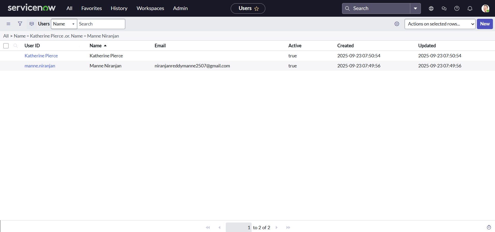
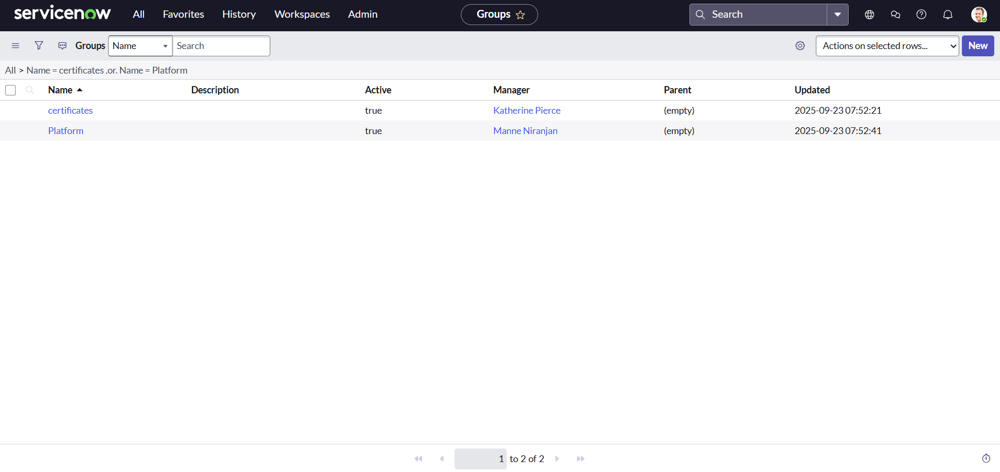
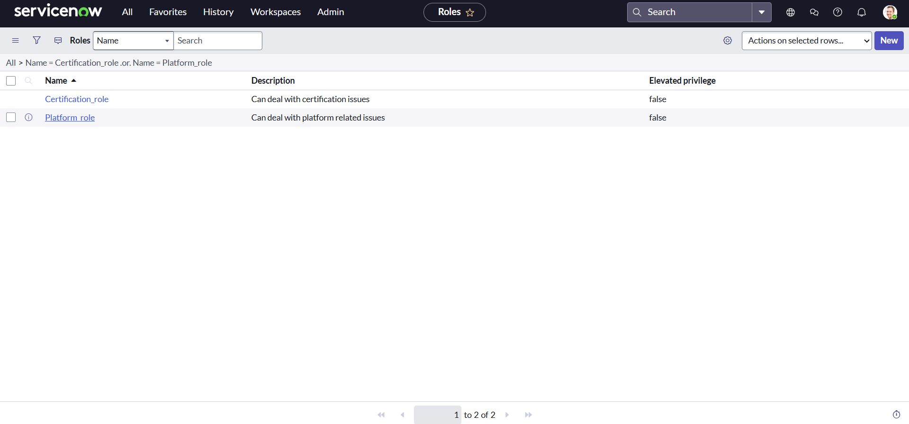
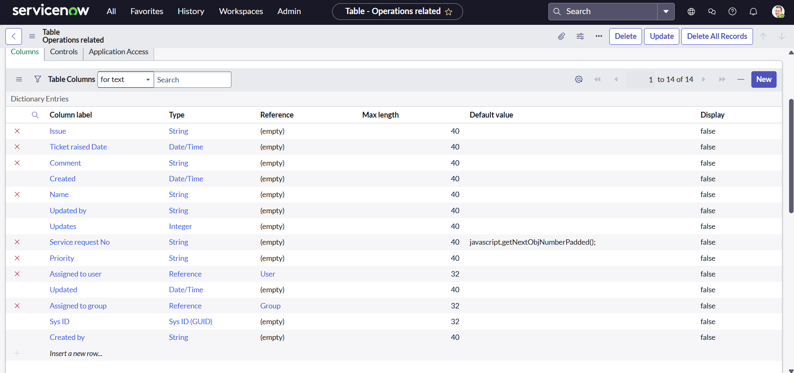
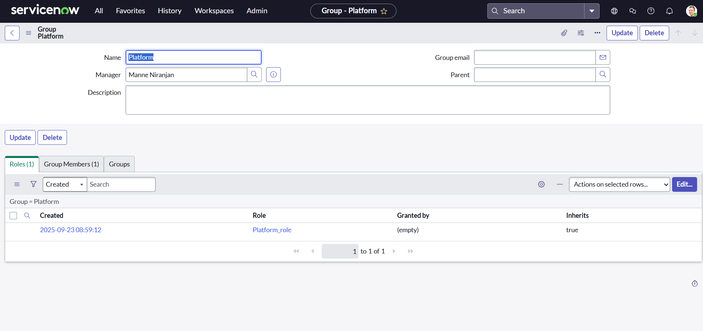
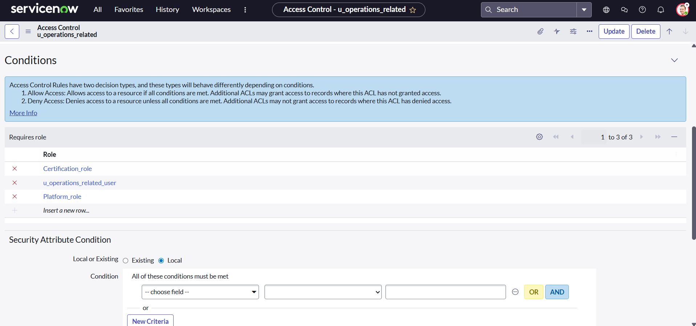
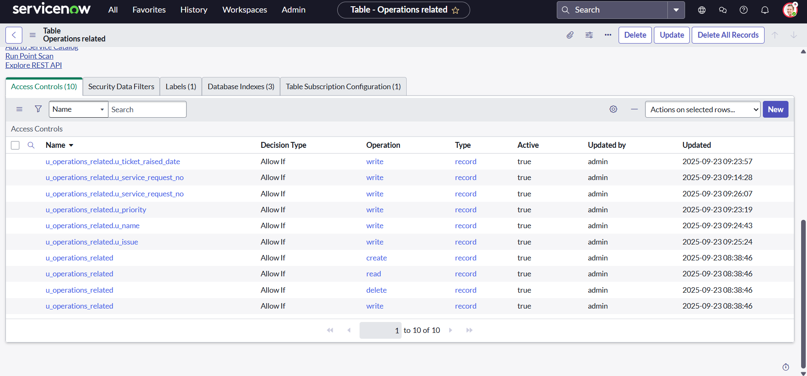
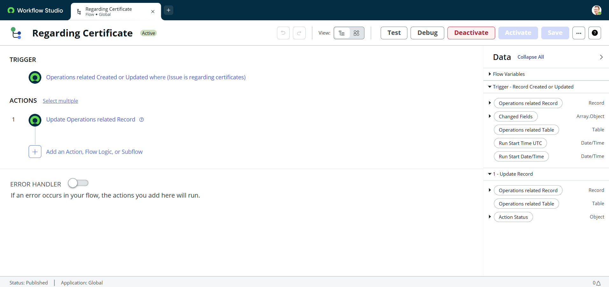
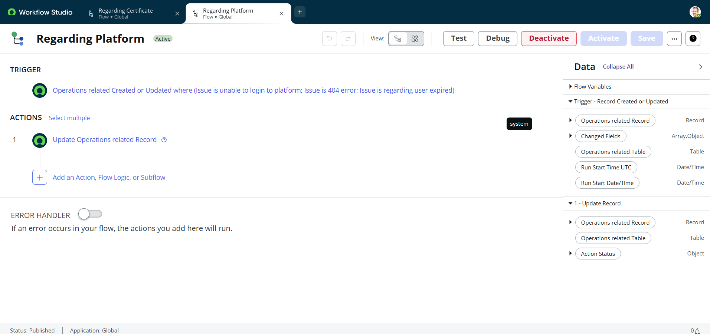

# Streamlining Ticket Assignment for Efficient Support Operations

## 📌 Project Overview
This project demonstrates the implementation of an **automated ticket routing system** in ServiceNow for ABC Corporation.  
The goal is to streamline the assignment of support tickets to the correct teams, improving **operational efficiency**, reducing **resolution delays**, and enhancing **customer satisfaction**.

## 🎯 Objectives
- Automate ticket assignment to appropriate groups based on issue type.
- Minimize manual intervention and errors in ticket routing.
- Ensure faster response and resolution of support requests.
- Improve utilization of support resources.

## ⚙️ Steps Performed
### 1. User Management
- Created new users in ServiceNow under **System Security > Users**.
- Example users: *Katherine Pierce*, *Manne Niranjan*.

### 2. Group Management
- Created groups under **System Security > Groups**.
- Example groups: *Certificate Group*, *Platform Group*.

### 3. Role Management
- Created custom roles under **System Security > Roles**.
- Example roles: *Certification_role*, *Platform_role*.

### 4. Table Creation
- Created a custom table: **Operations Related**.
- Added relevant columns and enabled module/mobile access.
- Added choices for the `issue` field:
  - Unable to login to platform  
  - 404 error  
  - Regarding certificates  
  - Regarding user expired  

### 5. Role & User Assignment
- Assigned users and roles to the respective groups:
  - *Katherine Pierce* → Certificate Group + Certification_role  
  
  - *Manne Niranjan* → Platform Group + Platform_role  
  

### 6. Table Access
- Configured **Application Access** for the table.  
- Restricted read/write access based on roles.

### 7. Access Control (ACL)
- Created ACLs under **System Security > Access Control (ACL)**.
- Restricted access with admin and role-based controls.

### 8. Flow Designer Automation
#### Flow 1: Assign to Certificate Group
- Trigger: New record in **Operations Related** table where issue = *Regarding Certificates*.  
- Action: Auto-assign ticket to **Certificate Group**.

#### Flow 2: Assign to Platform Group
- Trigger: New record in **Operations Related** table where issue = *Unable to login to platform*, *404 Error*, or *User expired*.  
- Action: Auto-assign ticket to **Platform Group**.

## 📊 Deliverables
- **Screenshots**: Proof of user, group, role, table, ACL, and flow setup.  
- **Documentation**: This README file.  

## 🚀 Tools Used
- **ServiceNow Developer Instance**
- **Flow Designer**
- **System Security (Users, Groups, Roles, ACLs)**

## ⚡ Conclusion
The automated ticket routing system in ServiceNow successfully streamlines ticket assignment, eliminating manual routing and ensuring tickets reach the correct teams.  
This improves **operational efficiency**, **response time**, and **customer satisfaction** while optimizing support resource usage.
